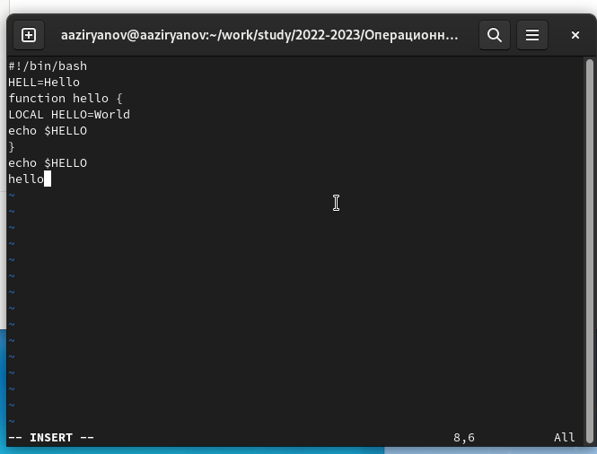
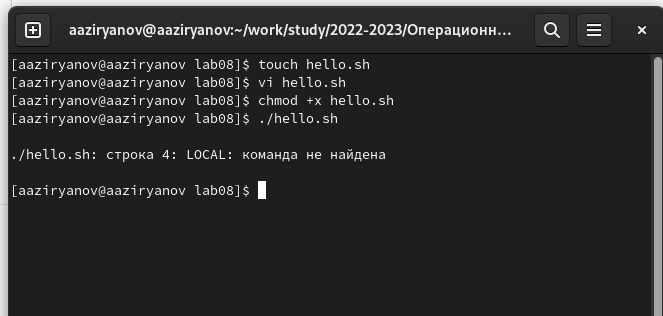
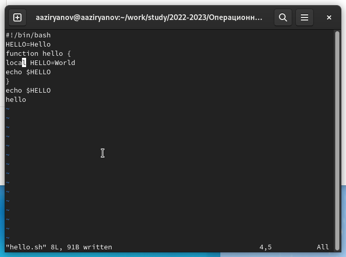
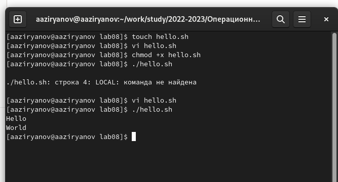

---
# Front matter
lang: ru-RU
title: "Отчёт по лабораторной работе №8"
subtitle: "Редактор Vi"
author: "Зырянов Артём Алексеевич	НБИбд-01-22"

# Formatting
toc-title: "Содержание"
toc: true # Table of contents
toc_depth: 2
lof: true # List of figures
fontsize: 12pt
linestretch: 1.5
papersize: a4paper
documentclass: scrreprt
polyglossia-lang: russian
polyglossia-otherlangs: english
mainfont: PT Serif
romanfont: PT Serif
sansfont: PT Sans
monofont: PT Mono
mainfontoptions: Ligatures=TeX
romanfontoptions: Ligatures=TeX
sansfontoptions: Ligatures=TeX,Scale=MatchLowercase
monofontoptions: Scale=MatchLowercase
indent: true
pdf-engine: lualatex
header-includes:
  - \linepenalty=10 # the penalty added to the badness of each line within a paragraph (no associated penalty node) Increasing the value makes tex try to have fewer lines in the paragraph.
  - \interlinepenalty=0 # value of the penalty (node) added after each line of a paragraph.
  - \hyphenpenalty=50 # the penalty for line breaking at an automatically inserted hyphen
  - \exhyphenpenalty=50 # the penalty for line breaking at an explicit hyphen
  - \binoppenalty=700 # the penalty for breaking a line at a binary operator
  - \relpenalty=500 # the penalty for breaking a line at a relation
  - \clubpenalty=150 # extra penalty for breaking after first line of a paragraph
  - \widowpenalty=150 # extra penalty for breaking before last line of a paragraph
  - \displaywidowpenalty=50 # extra penalty for breaking before last line before a display math
  - \brokenpenalty=100 # extra penalty for page breaking after a hyphenated line
  - \predisplaypenalty=10000 # penalty for breaking before a display
  - \postdisplaypenalty=0 # penalty for breaking after a display
  - \floatingpenalty = 20000 # penalty for splitting an insertion (can only be split footnote in standard LaTeX)
  - \raggedbottom # or \flushbottom
  - \usepackage{float} # keep figures where there are in the text
  - \floatplacement{figure}{H} # keep figures where there are in the text
---

# Цель работы

Познакомиться с операционной системой Linux. Получить практические навыки работы с редактором vi, установленным по умолчанию практически во всех дистрибутивах.

# Выполнение лабораторной работы

1. Создадим каталог с именем ~/work/os/lab06. 

2. Перейдем во вновь созданный каталог. 

{ #fig:001 width=70% height=70% }

3. Вызовем vi и создадим файл hello.sh vi hello.sh 

4. Нажмем клавишу i и введем текст из задания.
 
5. Нажмем клавишу Esc для перехода в командный режим после завершения ввода текста. 

6. Нажмем : для перехода в режим последней строки и внизу нашего экрана появится приглашение в виде двоеточия. 

7. Нажмем w (записать) и q (выйти), а затем нажмем клавишу Enter для сохранения нашего текста и завершения работы. 

{ #fig:002 width=70% height=70% }

8. Сделаем наш файл исполняемым и попытаемся его исполнить.

{ #fig:003 width=70% height=70% }

9. Вызовем vi на редактирование файла vi ~/work/os/lab06/hello.sh 

10. Установим курсор в конец слова HELL второй строки. 

11. Перейдем в режим вставки и заменим на HELLO. Нажмем Esc для возврата в командный режим. 

12. Установим курсор на четвертую строку и сотрем слово LOCAL. 

13. Перейдем в режим вставки и наберем следующий текст: local, нажмем Esc для возврата в командный режим. 

14. Установим курсор на последней строке файла. Вставим после неё строку, со- держащую следующий текст: echo $HELLO. 

15. Нажмем Esc для перехода в командный режим. 

16. Удалим последнюю строку. 

17. Введем команду отмены изменений u для отмены последней команды. 

18. Введем символ : для перехода в режим последней строки. Запишем произведённые изменения и выйдем из vi.

{ #fig:004 width=70% height=70% }

{ #fig:005 width=70% height=70% }

# Вывод

 В ходе роботы мы  познакомились с операционной системой Linux, и получили практические навыки работы с редактором vi, установленным по умолчанию практически во всех дистрибутивах UNIX. А также освоили основные режимы и команды

# Контрольные вопросы

Контрольные вопросы:

1. Дайте краткую характеристику режимам работы редактора vi.
Ответ: Редактор vi имеет три режима работы: 
a) командный режим — предназначен для ввода команд редактирования и навигации по редактируемому файлу; 
b) режим вставки — предназначен для ввода содержания редактируемого файла; 
c) режим последней (или командной) строки — используется для записи изменений в файл и выхода из редактора.

2. Как выйти из редактора, не сохраняя произведённые изменения?
Ответ: Ввести в командной строке клавиши q (или q!)

3. . Назовите и дайте краткую характеристику командам позиционирования.
Ответ: 
a) 0 (ноль) — переход в начало строки;
b) $ — переход в конец строки; 
c) G — переход в конец файла; 
d) n G — переход на строку с номером n.

4. Что для редактора vi является словом? 
Ответ: Редактор vi предполагает, что слово - это строка символов, которая может включать в себя буквы, цифры и символы подчеркивания.

5. Каким образом из любого места редактируемого файла перейти в начало (конец) файла?
Ответ: Каким образом из любого места редактируемого файла перейти в начало (конец) файла?
Здесь нам помогут команды позиционирования. 
a) – G — переход в конец файла; 
b) – 1 G — переход на строку с номером n (В нашем случаи начало файла).
 
6. Назовите и дайте краткую характеристику основным группам команд редакти- рования.
Ответ: Команды редактирования имеют девять командных блока: Команды редактирования имеют девять командных блока: Вставка текста, вставка строки, удаление текста, текстовой редактор vi, отмена и повтор произведённых изменений, копирование текста в буфер, вставка текста из буфера, замена текста, поиск текста, 
a) Вставка текста 
– а — вставить текст после курсора; 
– А — вставить текст в конец строки; 
– i — вставить текст перед курсором; 
– n i — вставить текст n раз; 
– I — вставить текст в начало строки. 
b) Вставка строки 
– о — вставить строку под курсором; 
– О — вставить строку над курсором. 
с) Удаление текста 
– x — удалить один символ в буфер; 
– d w — удалить одно слово в буфер; 
– d $ — удалить в буфер текст от курсора до конца строки; 
– d 0 — удалить в буфер текст от начала строки до позиции курсора; 
d) Текстовой редактор vi 
– d d — удалить в буфер одну строку; 
– n d d — удалить в буфер n строк. 
e) Отмена и повтор произведённых изменений
– u — отменить последнее изменение; 
– . — повторить последнее изменение. 
f) Копирование текста в буфер 
– Y — скопировать строку в буфер; 
– n Y — скопировать n строк в буфер; 
– y w — скопировать слово в буфер. 
g) Вставка текста из буфера 
– p — вставить текст из буфера после курсора; 
– P — вставить текст из буфера перед курсором. 
h) Замена текста 
– c w — заменить слово; 
– n c w — заменить n слов; 
– c $ — заменить текст от курсора до конца строки; 
– r — заменить слово; 
– R — заменить текст. 
i) Поиск текста 
– / текст — произвести поиск вперёд по тексту указанной строки символов текст; – ? текст 
— произвести поиск назад по тексту указанной строки символов текст.

7. Необходимо заполнить строку символами $. Каковы ваши действия?
Ответ: Здесь есть несколько вариантов.
1) Просто заполнять посимвольно строку в режиме редактирования.
2) При помощи команды  – I — вставить текст в начало строки, предварительно его копировав.
3) Вывести из буфера – p — вс ,предварительно удалив или копировав в буфер текст от курсора до конца строки– d $.
4) – c $ — заменить текст от курсора до конца строки;

8 Как отменить некорректное действие, связанное с процессом редактирования?
Ответ: При помощи блока команд Отмена и повтор произведённых изменений. В нем есть команда: – u — отменить последнее изменение.

9. Назовите и дайте характеристику основным группам команд режима последней строки
Ответ: Команды редактирования в режиме командной строки имеют три командных блока:
1) Копирование и перемещение текста 
– : n,m d — удалить строки с n по m; 
– : i,j m k — переместить строки с i по j, начиная со строки k; 
– : i,j t k — копировать строки с i по j в строку k; 
– : i,j w имя-файла — записать строки с i по j в файл с именем имя-файла.
2) Запись в файл и выход из редактора 
– : w — записать изменённый текст в файл, не выходя из vi; 
– : w имя-файла — записать изменённый текст в новый файл с именем имя- файла; 
– : w ! имя-файла — записать изменённый текст в файл с именем имя- файла; 
– : w q — записать изменения в файл и выйти из vi; 
– : q — выйти из редактора vi; 
– : q ! — выйти из редактора без записи; 
– : e ! — вернуться в командный режим, отменив все изменения, произве- дённые со времени последней записи 
3) Опции 
Опции редактора vi позволяют настроить рабочую среду. Для задания опций используется команда set (в режиме последней строки): 
– : set all — вывести полный список опций; 
– : set nu — вывести номера строк; 
– : set list — вывести невидимые символы; 
– : set ic — не учитывать при поиске, является ли символ прописным или строчным. Если мы хотим отказаться от использования sat перед именем опции надо поставить no

10. Как определить, не перемещая курсора, позицию, в которой заканчивается строка?
Ответ: Ввести команду full и символ. После этого вся строка заполнится этим символом, а курсор останется на месте.

11 Выполните анализ опций редактора vi (сколько их, как узнать их назначение и т.д.)
Ответ: Опции редактора vi позволяют настроить рабочую среду. 
Для задания опций используется команда set (в режиме последней строки): 
– : set all — вывести полный список опций; 
– : set nu — вывести номера строк; 
– : set list — вывести невидимые символы; 
– : set ic — не учитывать при поиске, является ли символ прописным или строчным. Если мы хотим узнать назначение опций, мы должны ввести в консоли man vi set.

12. Как определить режим работы редактора vi?
Ответ: Если мы находимся в режиме вставки, то внизу экран написано большими буквами: РЕЖИМ ВСТАВКИ переход в него осуществляется при помощи i. 
В командном режиме при нажатии клавиш, с текстом ничего не происходит. Нет внизу экрана  надписи: РЕЖИМ ВСТАВКИ. И отсутствует двоеточие внизу.
Если ввести в командном режиме команду:, то осуществится переход в режим последней строки
В режиме последней строки можно будет вводить такие команды, как wq (записать файл и покинуть редактор vi) или q! (выйти из редактора vi без сохранения изменений). Переход в него можно определить по двоеточию внизу слева.
 
13. Постройте граф взаимосвязи режимов работы редактора vi.
Ответ: 

1)	Переход осуществляется из A в B при помощи I и ESC обратно.
2)	Переход осуществляется из A в C при помощи : и ESC обратно.
3)	Переход осуществляется из A в D при помощи ? или / и ESC обратно.
4)	Переход осуществляется из A в E при помощи v и ESC обратно.
a) командный режим 
b) режим вставки 
c) режим строки 
d) Режим поиска
e) Визуальный режим

